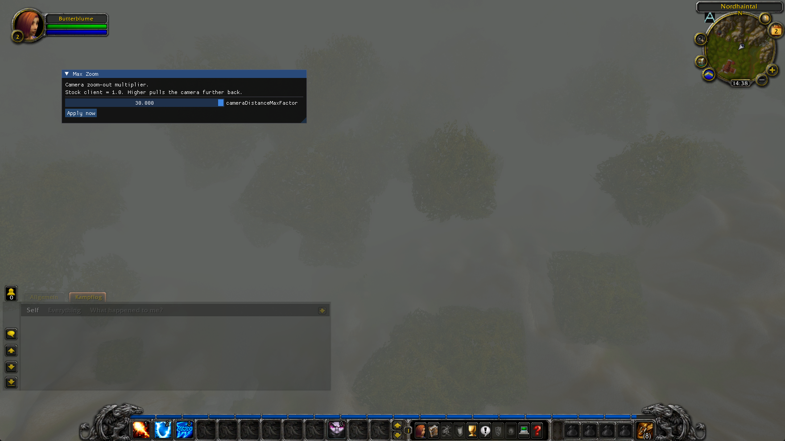

# wxl-maxzoom

**Lift the World of Warcraft 3.3.5a (build 12340) camera zoom-out limit far past the stock ceiling — adjustable live.**

A [WarcraftXL](https://github.com/WarcraftXL) module. The default client only lets the camera pull
back a short distance; the UI slider stops even shorter. `wxl-maxzoom` raises the client's own
`cameraDistanceMaxFactor` console variable so you can zoom way out — great for getting the whole
fight, a landscape, or a raid on screen at once.

> Built by [Michael Malura](https://malura.de).



## How it works

Two levers, together, take the camera far past its stock limit:

**1. The multiplier.** The client's `cameraDistanceMaxFactor` console variable scales the base camera
distance (`cameraDistanceMax`, default 15). The mod raises it through the client's *own* Lua/CVar
path — WarcraftXL exposes the engine's verified FrameScript executor, so it runs
`SetCVar("cameraDistanceMaxFactor", ...)` in the client's script context.

**2. The hard clamp.** On its own, lever 1 stops at ~50 yards: the engine computes the effective
distance as `min(cameraDistanceMaxFactor * cameraDistanceMax, 50.0)`, and that `50.0` is a hard
ceiling — a single float constant in the client's `.rdata` at `0x00A1E2FC`, reverse-engineered with
[Ghidra](https://ghidra-sre.org/) against build 12340. (It's *why* factor 6 and factor 30 looked
identical — both were clamped to the same wall.) The mod lifts that ceiling in process memory
(`VirtualProtect` → write → restore), so the multiplier actually controls the distance:
factor 30 → ~450 yards.

Both are re-asserted on every world enter (the client reloads CVars across loading screens), so the
zoom sticks across logins and zone changes.

### Is it safe?

- The memory write is **guarded**: it fires only when the address holds the known stock value
  (`50.0f`), touches one 4-byte float, and is **not persisted to disk** — restarting the client fully
  reverts it.
- WarcraftXL refuses to load a module built against a different client build than 12340, so the
  hardcoded address can never be applied to an image where it means something else.

## Install

**Via the WarcraftXL hub (recommended):** open the store in [wxl-hub](https://github.com/WarcraftXL/wxl-hub),
find **Max Zoom**, and hit install.

**Manually:** drop `wxl-maxzoom.dll` into your patched client at
`Extensions/wxl-maxzoom/wxl-maxzoom.dll`. You need a client already set up with the
[WarcraftXL](https://github.com/WarcraftXL/wxl-core) framework (`WarcraftXL.dll` + a patched
`Wow.exe`).

## Use

- Just play — the camera max-zoom is raised automatically as soon as you enter the world. Scroll out.
- Press **F9** to open the WarcraftXL overlay, then use the **Max Zoom** panel's slider to tune the
  multiplier live (1.0 = stock, higher pulls further back) — all the way up to a map-scale **30x**.

The default multiplier is `10`, and the slider goes to `30`. The client validates and clamps the
value to its own ceiling, so asking for more than it will grant is harmless — it just settles there.

## Build from source

Requires CMake ≥ 3.20 and a Win32 C++ toolchain (Visual Studio 2022). The module builds against the
WarcraftXL core, which acts as the build shell:

```sh
git clone --branch v1.1 --recurse-submodules https://github.com/WarcraftXL/wxl-core.git
git clone https://github.com/maluramichael/wxl-maxzoom.git wxl-core/extensions/wxl-maxzoom
cmake -S wxl-core -B wxl-core/build -A Win32
cmake --build wxl-core/build --config Release --target wxl-maxzoom
# -> wxl-core/build/Release/wxl-maxzoom.dll
```

The included GitHub Actions workflow does exactly this and publishes the DLL as a release on every
push.

## Credits

- Built on [WarcraftXL](https://github.com/WarcraftXL) by iThorgrim & contributors — the modding
  framework that makes client-side 3.3.5a mods like this possible.
- Module by [Michael Malura](https://malura.de).

## License

[GNU General Public License v3.0 or later](LICENSE) — the same license as WarcraftXL.
